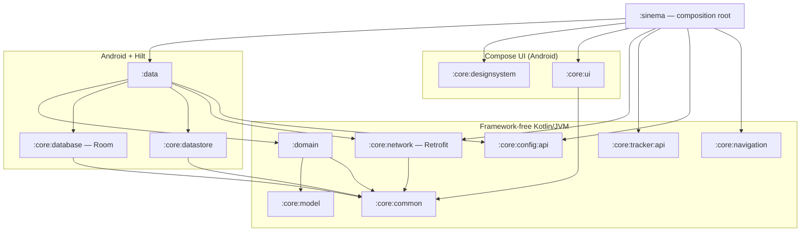

<!--
  GENERATED FILE — do not edit directly. Edit docs/technical-solution.html, then run:

      python3 docs/tools/artifact_to_markdown.py \
          docs/technical-solution.html README.md

  docs/technical-solution.html is the source of truth and is also published as a
  styled page. This Markdown mirror exists so the document is reviewable in
  pull requests and diffable alongside the code it describes.
-->

**Technical solution · Revision 21 · Native Android**

# Sinema — architecture & delivery plan

A TMDB movie explorer built as a modular, offline-first native Android app. This document records the architecture as it exists in the repository today, the reasoning behind each stack decision, and an honest account of what is built versus what is still scaffolding.

## §1 Summary & scope

Sinema browses TMDB content — trending and popular lists, movie detail, search, favorites — and must remain usable without a network connection. The technical solution therefore rests on three commitments: a strict Clean Architecture dependency rule, a local database as the single source of truth, and compile-time enforcement of both so the structure cannot decay silently.

The project was originally specified as Kotlin Multiplatform–ready. That requirement was withdrawn: the app is now **native Android only**, and the stack was realigned to the platform-idiomatic choice in every position where portability had dictated an alternative.

> **Decision of record**
>
> KMP is out of scope. Hilt replaces Koin, Room replaces SQLDelight, **Retrofit replaces Ktor**, `java.time` replaces kotlinx-datetime, Timber replaces Kermit, and the design system reverted from Compose Multiplatform to a standard Android library. kotlinx.serialization was deliberately *kept* — it is first-class on native Android and pairs with Retrofit through Square's official converter.

> **Decision of record · naming**
>
> **The product is Sinema.** The name applies to everything a user or a reader of this document encounters: the launcher label, the application module and package, the in-app attribution line, and the title of this document. `Cinelog` is retired as a product name — the last references to it, in preview sample data, were rewritten when this decision was taken, so it no longer appears anywhere in the codebase as a name.
>
> The design system was renamed with it. Every `Cine*` identifier is now `Sinema*` — 129 symbols across 17 files, plus the files themselves. The earlier argument for keeping the old prefix was that it marked shared components at a glance and that renaming would churn every UI file for no new information. That was a real cost but the wrong trade: a prefix is read constantly by anyone learning the codebase, and one that names a product that no longer exists teaches them something false on every line. The churn is paid once; the confusion would have been paid forever.
>
> The rename also removed an inconsistency worth noting, because it argues the same point. The token accessor was `CineTheme` while the theme composable that provides those tokens was already `SinemaTheme` — two names for one concept, split across the old boundary. They are now a single name in the Material 3 shape, an `object` and a `@Composable fun` sharing an identifier because Kotlin resolves classifiers and callables separately:
>
> ```kotlin
> SinemaTheme { … }              // wraps a subtree — the composable
> SinemaTheme.colors.textPrimary // reads a token — the object
> ```
>
> One identifier deliberately keeps its own name, and this is not an unresolved remainder: **`BigON`, the repository and Gradle root.** No user encounters it, and renaming a Gradle root is not free — the configuration cache is keyed to absolute paths, so it breaks the build until the stale state is cleared (§12). The distinction that settles it: the design-system prefix is *read* by everyone working in the codebase, whereas the Gradle root is *typed* by no one and displayed nowhere.
>
> The rule for any future instance: **a name anyone reads — user or developer — is Sinema; a name only the build machinery sees may keep its own.**

| Layer | Responsibility | Knows about |
| --- | --- | --- |
| **Presentation** | Compose screens, ViewModels, UI state. No business rules. | :domain, design system |
| **Domain** | Use cases and repository interfaces. Framework-free Kotlin. | :core:model, :core:common |
| **Data** | Repository implementations, DTO/entity mapping, data sources. | :domain, network, database |

## §2 Module graph

Thirteen Gradle modules in three bands. Business logic lives in **framework-free Kotlin/JVM modules** — not for portability, but because a module that cannot import `android.*` cannot leak platform types into business rules, and its tests run on the JVM in milliseconds.



| Rule | Why | Enforced by |
| --- | --- | --- |
| `:sinema` is the only composition root | SDK adapters bind in one place; nothing else sees a vendor SDK. | Hilt graph + review |
| Features never depend on `:data` | Implementations arrive by injection, so data can be swapped or faked. | Konsist |
| Features never depend on each other | Cross-feature traffic goes through navigation contracts or use cases. | Konsist |
| No `android.*` in JVM modules | Keeps business logic testable without Robolectric or a device. | Konsist + plugin |
| `Context` only in app and adapters | Prevents Context creeping into constructors of logic classes. | Konsist |
| `androidx.navigation` only in the shell | Screens take callbacks, so the navigation host stays replaceable in one place. | Konsist |

## §3 Stack decisions

| Concern | Decision | Rejected | Rationale |
| --- | --- | --- | --- |
| Dependency injection | Hilt 2.60.1 | Koin, manual DI | Compile-time graph validation — a missing binding fails the build, not production. Standard on Android teams. |
| Database | Room 2.8.4 | SQLDelight, Realm | First-party, Flow-native, compile-time query verification, best tooling and hiring familiarity. |
| Networking | Retrofit 3.0.0 · OkHttp 5.4.0 | Ktor | The Android standard: declarative service interfaces, suspend support, and an interceptor stack the whole ecosystem (auth, logging, caching, Chucker) plugs into. |
| Serialization | kotlinx.serialization | Moshi, Gson | Compiler-plugin based, no reflection, native Kotlin nullability. Bridged by Square's official Retrofit converter. |
| UI | Compose BOM 2026.06.01 | Views/XML | Declarative UI with a token-driven design system; adaptive layouts without duplicate screens. |
| Async | Coroutines + Flow | RxJava, LiveData | Structured concurrency; dispatchers injected rather than referenced statically. |
| Key–value storage | DataStore 1.2.1 | SharedPreferences | Async, transactional, Flow-based reads. |
| Date & time | java.time | kotlinx-datetime | Platform standard, desugared safely at minSdk 26. |
| Logging | Timber 5.0.1 | Kermit | Android idiom; debug-only tree planted in the Application. |
| Codegen | KSP 2.3.10 | kapt | Substantially faster; required by AGP 9's built-in Kotlin. |
| Pagination | Manual append | Paging 3 + RemoteMediator | Paging 3 would leak `PagingData` through every domain signature, replacing framework-free `Flow<List<Movie>>` contracts with a library type, and its remote-keys table and load-state machine buy placeholders and eviction this app does not need. A `page` column plus an append path keeps the domain clean and every case unit-testable with the existing fakes. |
| Architecture guardrails | Konsist 0.17.3 | Review only | Layering rules run as unit tests, so violations fail CI instead of accumulating. |

> **Build-tooling constraint**
>
> The catalog currently pins `AGP 9.3.1`, and the Gradle CLI builds cleanly with it. Android Studio on the Quail line (2026.1.x) has previously rejected anything above `9.2.1` at sync time — an IDE-side restriction, not a compiler one. If sync fails, drop `agp` to `9.2.1` in the version catalog; it is a one-line change and the whole graph follows it.

## §4 Cross-cutting contracts

### Errors are values

No exception crosses a layer boundary. Retrofit service calls are wrapped by `ApiCaller`, which converts transport, HTTP and parsing failures into a sealed result — so callers handle failure exhaustively and the compiler proves they did.

```kotlin
sealed interface AppResult<out T> {
    data class Success<T>(val value: T) : AppResult<T>
    data class Failure(val error: AppError) : AppResult<Nothing>
}

sealed interface AppError {
    sealed interface Network : AppError {
        data object NoConnection : Network
        data object Timeout : Network
        data class Http(val code: Int, val body: String?) : Network
    }
    data class Serialization(val cause: String) : AppError
    data class Unknown(val cause: String) : AppError
}
```

Service interfaces stay plain Retrofit and live beside their DTOs in `:data`; the safe-call wrapper is the only thing repositories share.

```kotlin
// :data — endpoint contract owned by the feature that uses it
interface MovieApi {
    @GET("movie/popular")
    suspend fun popular(@Query("page") page: Int): MovieListDto
}

// :data — repository call site: failure is a value, never a throw
val result: AppResult<MovieListDto> = apiCaller.execute { movieApi.popular(page = 1) }
```

### Ports & adapters

Every third-party capability is consumed through an interface owned by a framework-free module. Analytics is the worked example: screens depend on `AnalyticsTracker` and a typed event catalog, while each SDK arrives as an `AnalyticsSink` contributed to a Hilt multibinding. Consent gating and off-caller dispatch live in the pipeline, never at the call site.

```kotlin
// :core:tracker:api — the port screens see
interface AnalyticsTracker { fun track(event: AnalyticsEvent) }

// :sinema — adding an SDK is one binding, invisible to callers
@Provides @IntoSet
fun provideTimberSink(): AnalyticsSink = TimberAnalyticsSink()
```

Remote config follows the same shape: a typed `FeatureFlag` registry with compile-time defaults, a `FeatureFlagRepository` port, and a swappable `FeatureFlagDataSource` backend. Value resolution is local override → backend → compile-time default, so the app is fully functional offline and before first fetch.

### Navigation

One approach, committed: **Navigation Compose with type-safe routes**. Destinations are `@Serializable` values in `:core:navigation` — a framework-free JVM module with no Compose, no Android and no navigation library on its classpath. A movie id therefore travels as a `Long`, and a wrong argument is a compile error rather than a blank screen at runtime.

```kotlin
// :core:navigation — no framework on the classpath
@Serializable sealed interface SinemaDestination
@Serializable sealed interface TopLevelDestination : SinemaDestination

@Serializable data object HomeDestination : TopLevelDestination
@Serializable data class MovieDetailDestination(val movieId: Long) : SinemaDestination
```

The `Navigator` contract that revision 10 reported was **deleted rather than finished**. A navigator injected into ViewModels is a second back stack living in the DI graph, and a second back stack can disagree with the real one. Screens raise plain callbacks — `onMovieClick: (Long) -> Unit`, `onBack: () -> Unit` — and a single `NavHost` in `:sinema` decides what they mean. Exactly three files in the codebase import `androidx.navigation`; the Konsist rule in §2 keeps it that way, which is what makes the host replaceable without touching a screen.

Chrome is **derived from the back stack**, never tracked beside it. The selected tab is computed from the current back-stack entry, so it survives process death and cannot disagree with what is displayed. Tab switches use `saveState`/`restoreState` with `launchSingleTop`, so each tab keeps its own scroll position and repeated taps do not grow the stack. The host sits inside the app's single `SharedTransitionLayout` — that placement is what lets a poster animate from any grid into the detail header across a real back stack, rather than only within one screen.

### Caching a payload the domain model cannot describe

Detail was the last read with no offline story, and adding eight appended blocks made that worse: every open re-paid ~224 KB. It is now cached, but the shape resisted the pattern used everywhere else — the CSV type converters behind the favourites snapshot cannot carry nested cast, recommendations and per-region providers, and normalising into five tables would be machinery for data only ever read whole.

So the row stores one JSON document, and the interesting decision is *which* JSON. Not the API response: that is ~224 KB of regions and crew the app discards. Not the domain model either — annotating `MovieDetail` for serialization would make the storage format part of the contract every layer shares, and the next storage decision would have to be argued there too. Instead `:data` owns a private snapshot type, roughly a tenth the size, and `:core:database` treats the column as opaque text.

The test that keeps this honest asserts `fresh == fromCache` across the whole aggregate, so a field added to `MovieDetail` but forgotten in the snapshot mapping fails a test rather than silently vanishing the next time a user goes offline.

### Composable identity is positional — keep the tree shape stable

Hiding the navigation bar on full-bleed destinations looks like a one-line conditional, and the first version was one: content rendered directly when the bar was hidden and inside a `Column` when it was shown. It compiled, it looked right on both screens, and it quietly broke scroll restoration on the way back from detail — which reads as a navigation bug even though nothing in the navigation code is wrong.

Compose identifies state by *position in the tree*. Moving `content()` between two different parents is not a re-render; it is a different composable, so every `rememberSaveable` beneath it — including the `LazyGridState` holding the scroll offset — is discarded and rebuilt at zero. The fix is to keep one structure for every combination of width and bar visibility, varying only what is *added around* the content so its path never changes:

```kotlin
Row {
    if (useRail && showNavigation) SinemaNavigationRail(…)
    Column(Modifier.weight(1f)) {
        Box(Modifier.weight(1f)) { content() }   // always Row → Column → Box
        if (!useRail && showNavigation) SinemaBottomBar(…)
    }
}
```

Verified by pixel comparison on device: scroll to an arbitrary offset, open a detail, press back — the grid region is now byte-identical, as is the case where the tab is switched away and back.

> ### Threading contract
>
> Dispatchers are injected via `DispatcherProvider`. Data sources switch to IO internally; ViewModels consume already main-safe APIs and never call `withContext`. Main-safety is a documented property of every repository function.

> ### Presentation pattern
>
> Unidirectional data flow: each screen declares `UiState`, `Intent`, and `Effect` beside its ViewModel. State flows down as `StateFlow`, events flow up as intents, one-shot effects go through a channel. Composables hold no logic.

## §5 Design system

`:core:designsystem` is a living style guide in code: no screen hardcodes a color, size, or text style. Tokens are provided through composition locals and read via a single `SinemaTheme` accessor, which also mirrors them into `MaterialTheme` so stock Material 3 components inherit the palette. Switching theme recolors the entire app with zero component changes.

| Level | Contents |
| --- | --- |
| **Tokens** | `SinemaColors` (dark + light role sets) · `SinemaTypography` (display → caption) · `SinemaSpacing` (4–24dp, the only dp values features may use) · `SinemaShapes` (card / container / pill) · `SinemaIcons` |
| **Components** | MovieCard & ShimmerCard · SectionHeader · CastCard · ListItem · SearchBar · Chip & ChipRow · Primary/Tonal buttons · FavoriteToggle · SegmentedControl · SettingRow · OfflineBanner · Snackbar · LoadingIndicator · EmptyState · AttributionFooter · AppScaffold |

**Previews are part of the component contract.** Every component, token file and icon carries its own `@Preview` functions in the same file, so opening a component in the IDE shows its states immediately — roughly 92 preview functions expanding to ~160 rendered variants. Four multipreview annotations do the multiplying: `@SinemaThemePreview` (light + dark), `@SinemaFontScalePreview` (85%→200%), `@SinemaDevicePreview` (phone / foldable / tablet) and `@SinemaRtlPreview`. `SinemaComponentGallery` renders every token and component on one canvas for reviewing a theme change.

Two rules keep it scalable: images are passed as **slots**, so the design system never depends on an image loader; and `AppScaffold` adapts its own navigation — bottom bar under 600dp, rail above — so screens never branch on device type.

The app also ships a real **adaptive launcher icon** — separate background, foreground and monochrome layers as vector drawables, so it masks correctly to whatever shape the launcher asks for and supports themed icons on Android 13+. The monochrome layer is the part teams usually skip; without it a themed-icon launcher falls back to a shrunken full-colour badge.

## §6 TMDB integration

The product is a client for [TMDB](https://developer.themoviedb.org/): free for non-commercial use, protections around 40 requests/second (HTTP `429` when exceeded), and a documented v4 bearer-token scheme. Authentication is **implemented and verified against the live API**; the remaining work is entirely in the data model.

### Authentication — done

TMDB issues two credentials and they are strict inverses: the v3 API key authenticates *only* as an `api_key` query parameter (401 as a bearer header), while the v4 read access token authenticates *only* as `Authorization: Bearer` (401 as a query parameter). Both were confirmed against the live API.

`TmdbCredentials` therefore models both, exposes the `scheme` that will actually be used, and prefers the token when both are present — so swapping credentials is configuration, not code. `AuthInterceptor` applies the matching scheme and `OkHttpClientFactory` redacts *both* leak paths: `redactHeader("Authorization")` and `redactQueryParams("api_key")`. The type's `toString()` prints only the scheme name, so a credential cannot slip into a log or crash report through string interpolation.

### Endpoint map

| Screen / element | Endpoint | Notes |
| --- | --- | --- |
| Home — "Trending today" | /trending/movie/day | — |
| Home category chips | /movie/{popular,now_playing,top_rated,upcoming} | Four lists must not overwrite each other in one table |
| Search | /search/movie?query= | Debounce with the existing `Flags.SearchDebounceMs` (300ms) |
| Detail, cast, trailer, recommendations, certification, keywords, IMDb, streaming | /movie/{id}?append_to_response=credits,videos,recommendations,similar,release_dates,keywords,external_ids,watch/providers | One call, not eight. The block list is a byte budget — see §10 for what was excluded and why |
| Genre names | /genre/movie/list | Fetch once, cache — list endpoints return ids only |
| Favorites | local only | Room; no endpoint |

### Model gaps — closed by the Home slice

Each row below was a real defect waiting to happen; all five are now handled in `MovieMapper`, the Room schema, or the image layer, and covered by unit tests.

| TMDB reality | Consequence today | Fix |
| --- | --- | --- |
| List items carry `genre_ids: [int]`, never genre names | `SinemaMovieCard` meta renders "2026 · " and the genre chips cannot filter — `Movie` has no genre field at all | Cache `/genre/movie/list`; map ids→names in `:data`; add `genres` to the model |
| `release_date` is `""` for unknown dates, not null | `LocalDate.parse("")` throws inside the mapper, surfacing as `AppError.Unknown` | Lenient parse → `null` |
| `vote_average` is `0.0` for unrated titles | Every unrated movie shows a "★ 0.0" badge | Map `vote_count == 0` → null rating; the card already hides a null badge |
| Responses are paginated (`page`, `total_pages`) | Every list was capped at TMDB's 20-item page 1; `total_pages` was parsed and then ignored | `listKey` + `page` columns, an append path, and infinite scroll — see below |
| `poster_path` is a fragment — full URL is `https://image.tmdb.org/t/p/{size}{path}` | No image loader is wired: Coil sits in the version catalog but in zero modules | Add `coil-compose` + `coil-network-okhttp` sharing the existing `OkHttpClient`; `w342` for cards, `w780` for backdrops |

### Pagination

Home categories and search results page continuously. `refresh` replaces a list with page 1; `loadMore` reads `MAX(page)` for that `listKey`, fetches the next one and appends it, returning `EndReached` once `total_pages` is exhausted so the UI stops asking. A shared `LoadMoreEffect` on the grid state fires within six items of the end, guarded by an `isAppending` flag so a fast scroll cannot double-fire.

| Edge case | Handling |
| --- | --- |
| TMDB repeats a title across adjacent pages | Room inserts with `OnConflictStrategy.IGNORE` — first sighting keeps its position. REPLACE would silently reorder the list. |
| Ordering across appends | New rows continue from `MAX(position)`, so order survives duplicates being dropped. |
| Search paging (uncached) | Pages accumulate in the ViewModel with `distinctBy { id }`; a query or genre change resets to page 1, and a response that lands after the query changed is discarded rather than mixed in. |
| Append failure | Fails quietly and leaves existing content — scrolling again retries. Only a *refresh* failure surfaces a banner. |
| Cold `loadMore` with nothing cached | Falls back to a refresh rather than requesting page 2 of an empty list. |

Verified on device: scrolling Home issued `page=2` through `page=8`, exactly one request each; search paged through five pages of `/discover`.

> **Attribution — resolved**
>
> TMDB's Terms of Use §3 require the TMDB logo plus this exact notice: *"This [application] uses TMDB and the TMDB APIs but is not endorsed, certified, or otherwise approved by TMDB."* This paragraph previously recorded three defects: the footer paraphrased the notice, showed no logo, and appeared on Settings only. The logo shipped, and the wording is now quoted character-for-character in `TMDB_ATTRIBUTION`. Settings-only placement stands — the terms ask that the mark be *less* prominent than the app's own branding, which a footer satisfies.
>
> The paraphrase survived a review that had already caught it, because a later section of this same document declared the work done and quoted the wrong string back. A licence condition is worth checking against the licence, not against your own notes.

> ### Key handling
>
> Both credentials live in `local.properties` (gitignored) and reach the app through `BuildConfig`; they appear in no source file, build script or committed config, and the build warns at configure time if neither is set. They are nevertheless **compiled into the APK and recoverable** by unpacking the dex — obscurity, not security. Acceptable for a portfolio app with a free, read-only, rotatable token; a commercial product would proxy TMDB behind its own backend so the app never holds a credential. Note the v4 token embeds the v3 key in its `aud` claim, so rotating one invalidates both.

### Attribution — done

TMDB requires two things together: their mark, and the notice *"This product uses TMDB and the TMDB APIs but is not endorsed, certified, or otherwise approved by TMDB."* Both now ship, emitted by a single `SinemaAttributionFooter` so no screen can paraphrase the wording — the same define-it-once rule the design system applies to colour and spacing, for the same reason. Defining it once is why correcting it later was a one-line change; it did not stop the wrong string being defined in the first place.

The interesting part was verifying it rather than writing it. The mark shipped here as a monochrome silhouette: every opaque pixel pure black. Drawn as-is it looked perfect in light theme and was **invisible in dark** — measured at **1.14:1** against the dark background, where WCAG asks 3:1 for a graphical object. The fix applied at the time was a tint to the caption colour, which put it at **7.45:1 dark / 6.52:1 light** in one line.

> **…and that fix was wrong**
>
> Two mistakes, stacked. WCAG 1.4.11 *exempts* logos from contrast requirements — for exactly this reason, that a trademark is not the implementer's to adjust. And the governing rule for this asset was never WCAG at all; it is TMDB's terms, which forbid derivatives of their content. The measurement was sound and the conclusion inverted: a mark invisible in dark theme was evidence of **the wrong asset**, not of a missing colour filter.
>
> The silhouette was not an official asset. TMDB publishes five variants and every one is their green→teal→blue gradient; there is no monochrome version, so there was nothing to tint that would still be their logo. Sinema now ships the official *Alt short* SVG as a gradient `VectorDrawable`, unmodified, with no `colorFilter`:
>
> ```kotlin
> Image(
>     painter = painterResource(R.drawable.ic_tmdb_logo),
>     contentDescription = "The Movie Database (TMDB)",
>     modifier = Modifier.width(72.dp),   // no tint: not ours to recolour
> )
> ```
>
> It measures roughly **2:1 on light** and **8:1 on dark**. The low end stands, and is the correct outcome — that is the mark as its owner draws it.

Worth generalising twice. A monochrome asset dropped into a themed app is a latent defect in whichever theme matches its ink, and screenshot review in one theme cannot catch it — contrast has to be measured in both. But measuring the right number does not mean you are applying the right rule: before styling a third-party asset into compliance, check whether the rule you are satisfying is the one that governs it.

> **Placement — a judgement call, not an oversight**
>
> The notice appears once, in Settings, which is the conventional home for it and satisfies the requirement to display attribution. TMDB does not mandate per-screen placement. Recording it here so the choice is visibly deliberate: if the app is ever submitted for TMDB review and they ask for prominence, the component is already shared and can be dropped onto detail or an About screen without touching its wording.

## §7 Build, tooling & enforcement

Module configuration is centralized in **convention plugins** under `build-logic`, so no module build file repeats SDK levels or dependency boilerplate, and cross-cutting build changes are made once per archetype.

| Archetype | Configures | Applied by |
| --- | --- | --- |
| convention.jvm-library | Kotlin/JVM, JVM 11, coroutines, test deps | 7 modules |
| convention.android-library | AGP library, SDK levels, Java/Kotlin target | 5 modules |
| convention.android-hilt | KSP + Hilt plugin and compiler | 4 modules |
| convention.compose | Compose compiler, BOM, tooling | 2 modules |
| convention.feature | Compose + Hilt + standard feature deps | ready |

### Automated guardrails

| Check | Scope | Tests |
| --- | --- | --- |
| Konsist architecture rules | Layer imports, Context containment, domain whitelist, banned stacks (Koin/Moshi/Gson/RxJava) | 4 |
| Feature-flag resolution | Override → backend → default precedence and reactive re-emission | 4 |
| Network stack | Real Retrofit/OkHttp against MockWebServer: typed conversion, HTTP status, malformed payload, plus both credential schemes, precedence, the unauthenticated path and credential redaction | 8 |
| Analytics pipeline | Multi-sink fan-out, per-sink filtering, consent gating | 3 |
| Hilt object graph | Validated at compile time — a missing binding breaks the build | — |

Dependency versions live in a single Gradle version catalog. Nothing else in the build declares a version, so upgrades and audits are one file.

## §8 State of implementation

> **Honest assessment**
>
> **The architecture is now proven end to end.** Home fetches five TMDB categories through the full stack — service → DTO → mapper → Room → repository → use case → ViewModel → Compose — and renders real posters. Offline-first was verified on a device: with the network disabled, a cold start still showed the cached list, with a retry notice above it rather than an empty screen.
>
> Exercising the abstractions keeps finding defects that review does not. `SinemaShimmerCard` crashed when a grid sized it (it ignored `Dp.Unspecified`, unlike `SinemaMovieCard`); the Konsist `Context` rule had a stale package prefix left over from the rename, so it was silently guarding nothing in the app shell; scroll position was lost returning from detail because the scaffold moved content between two parents (§4); and the TMDB mark was invisible in dark theme at 1.14:1 (§6). All are fixed. The pattern is consistent enough to state plainly: **each of these was invisible in code review and obvious within seconds of real use** — which is the argument for the device-verification step, not the test suite, being the gate that catches them.
>
> Breadth is now largely covered: every screen is real and every mock is gone. What remains is structural (feature-module extraction), a backend behind the analytics and remote-config ports, and the production hardening in §9·05.

| Area | Status | Detail |
| --- | --- | --- |
| Build, modules, conventions | **Done** | 13 modules, 5 archetypes, catalog, clean build |
| Design system | **Done** | Tokens + 16 components + ~92 in-file previews; both themes verified on device |
| DI composition root | **Done** | Hilt graph compiles; adapters bound in `:sinema` only |
| Guardrails & tests | **Done** | 130 unit tests green; five Konsist rules enforcing layering, including one that keeps `androidx.navigation` inside the app shell |
| Domain layer | **Done** | `MovieRepository` contract plus observe/refresh use cases |
| Movie data pipeline | **Done** | DTOs, `MovieApi`, mapper and offline-first repository; Room is the single source of truth, per-category |
| Feature modules & ViewModels | **Partial** | Every screen is real — UDF contracts, ViewModels, zero mocks — but they live in `:sinema` rather than `feature/*` modules; extraction is the remaining structural step (§9·03) |
| Favorites | **Done** | Local-only snapshots in their own Room table (survive cache clearing and offline); heart on detail; grid opens detail with the shared-element transition |
| Settings | **Done** | Theme persisted via DataStore (survives process death, verified on device); **content region picker** over the 139 regions TMDB holds data for, searchable by name or code, with "follow device" as a distinct option; real clear-cache with computed size — catalogue + images, favourites kept; app version row |
| Pagination | **Done** | Infinite scroll on Home and Search; append with dedupe, end-of-list detection, quiet append failures. Room gained a `page` column (DB v4) |
| Search | **Done** | Hybrid: blank query browses `/discover` (genre server-side), typed query hits `/search` (genre client-side); debounced via `Flags.SearchDebounceMs` — the flag system's first real consumer — with `mapLatest` cancellation; real genre chips from the cached table; results open detail with the shared-element transition |
| Movie detail | **Done** | One call carrying every Tier 1 block: backdrop and studio title logo, cast, trailer, age certification, themes, an IMDb link, streaming availability for the chosen region, alternative titles, a device-language overview merged field-by-field, and a "More like this" row that makes detail open detail. Reviews ride a second request so they paginate and fail independently. Shimmer skeleton on load, and a sticky toolbar whose title logo fades in only once the hero has scrolled away. Cached in Room (DB v5) so a second open costs nothing and works offline |
| Person | **Done** | Reached from any cast card on movie or series detail: profile, lifespan, birthplace, a biography that collapses at five lines, and a filmography merging cast and crew credits de-duplicated by film. Network-only by design — it is always a tap-through, never a landing screen (§10 Tier 3) |
| Collection | **Done** | Franchise view reached from detail, where the reference already arrives free in the payload. Parts ordered by release with undated entries last; round-trips through the detail snapshot so an opened franchise stays readable offline |
| TV series detail | **Done** | Sibling of movie detail, not a generalisation of it: seasons and episode counts instead of a runtime, certification from `content_ratings` with a US fallback. Closes the trending hand-off — series cards now open natively rather than leaving for TMDB's website. Seasons and episodes are explicitly out of scope |
| Browse refinements | **Done** | Sort, release year, rating floor and maximum runtime over `/discover`, in a sheet that batches its selections into one request. Shown only while browsing, since a typed query honours none of them. The rating floor is paired with a vote-count floor in the repository, where the rule cannot be forgotten by a call site |
| In-app updates | **Done** | Both flows behind a one-wrapper module (`:core:update`): priority 5 forces, priority 4 forces after a week, everything below suggests via a bottom sheet over a working app. Forced blocking removes the app from composition rather than covering it; optional prompting is rate-limited per version — see §11. |
| Navigation | **Done** | Real `NavHost` with type-safe `@Serializable` routes in `:core:navigation`; the speculative `Navigator` contract was deleted, not completed. Tab selection derives from the back stack rather than an enum, and `androidx.navigation` is confined to three shell files by a Konsist rule (§4) |
| Remote config & analytics backends | **Speculative** | Full port machinery with one debug sink, no backend, and no flag read by any screen |
| Images | **Done** | Coil 3 sharing the app's OkHttp client; auth is host-scoped so image requests carry no credential |
| TMDB attribution | **Done** | TMDB's mark plus their required wording verbatim, rendered by a single `SinemaAttributionFooter`. The bundled mark is a monochrome silhouette, so it is tinted to the caption colour — untinted it scored 1.14:1 against the dark background, i.e. invisible; now 7.45:1 dark / 6.52:1 light, measured on device (§6) |
| TMDB authentication | **Done** | Both credentials configured and verified live; dual-scheme interceptor with log redaction |
| Secrets & services | **Partial** | TMDB credentials in place; no Firebase project yet |

## §9 Delivery sequence

Deliberately ordered: the first slice validates the architecture end to end, and everything after it builds on proven ground rather than assumptions.

1. **Home vertical slice — the validation step** — **Done**

   TMDB popular list through the full stack: `MovieApi` + DTO → Room as single source of truth → `MovieRepository` → use case → `HomeViewModel` with the UDF contracts → existing Sinema components. Credentials are already in place; this needs the five model fixes in §6 — genres, lenient dates, the unrated-rating rule, a `listKey` column and a wired image loader. This one slice exercises every cross-cutting contract in §4 and will confirm or correct them.

2. **Simplify what the slice disproves** — **First cut done**

   With a real consumer in place, collapse abstractions that earned nothing — likely candidates are the separate `tracker:api` and `config:api` modules (packages would do until a second backend exists) and the unused parts of the flag lifecycle.

   The `Navigator` port was the first to go, and it is the template for the rest: a sealed `NavigationCommand` type, a `DefaultNavigator` and a Hilt binding, all written to keep navigation swappable and none of it ever called. Building the real graph showed why the abstraction could not earn its keep — Navigation Compose already expresses destinations as plain `@Serializable` values, so the part worth keeping portable was the *data*, not a command bus wrapped around it. The data stayed; the machinery went; a Konsist rule now guards the seam the port was supposed to protect. Three production types replaced by one test is the shape to look for in the remaining candidates.

3. **Navigation · feature extraction** — **Done**

   Navigation is settled: one committed approach, a real `NavHost` with typed routes, and the `Navigator` contract deleted rather than finished — see §4. What remains of this step is the extraction: moving the screens out of `:sinema` into `feature/*` modules using the ready feature archetype. The destination types already sit in a shared framework-free module, so features will be able to reference each other's routes without depending on each other.

4. **Detail · Search · Favorites · Settings** — **All done**

   All four shipped: detail with the shared-element transition and two-pass paint, search with hybrid semantics and debounce, favourites as offline-proof snapshots, settings with persisted theme, a content region picker and real cache management. Four more screens arrived with the API backlog (§10) — person, collection, series detail, and the browse refinement sheet — on the same UDF contract, which is the useful signal: the archetype absorbed a new content domain without being reopened. What remains of this step is structural — feature-module extraction — plus the adaptive list–detail layout for tablets and foldables that `AppScaffold` already anticipates.

5. **Production hardening**

   Firebase analytics and Remote Config adapters behind the existing ports, crash reporting, R8 configuration, baseline profiles, screenshot tests per window size class, and CI wiring.

## §10 API backlog

Everything below was probed against the live API with this project's own credentials, so the endpoints, response shapes and counts are verified rather than assumed. The tiers are ordered by cost, not by appeal: tier 1 costs no extra network call at all.

### Tier 1 — complete — **Shipped**

Additional blocks ride the request detail already makes, so each is a comma and a DTO rather than a round trip. An earlier revision of this document called that *free*. It is not, and the correction is the useful part: one request is not one cost. Measured against the live API for a single title:

| Block | Payload | Share | Status |
| --- | --- | --- | --- |
| credits | 101.9 KB | 26% | Already paid — and it carries the full crew, which the DTO discards. TMDB has no cast-only variant. |
| recommendations | 14.4 KB | 4% | **In** "More like this" row |
| similar | 13.6 KB | 3% | **In** merged behind recommendations as a fallback |
| release_dates | 17.6 KB | 4% | **In** certification chip — 85 countries arrive, one is shown |
| keywords | 0.7 KB | 0.2% | **In** "Themes" chips |
| external_ids | ~0.2 KB | — | **In** IMDb link |
| watch/providers | 57.8 KB | 15% | **In** "Where to watch" — 98 regions arrive, one is shown |
| images | 30.7 KB | — | **In** studio title logo on the hero. Scoped with `include_image_language=en`: 132 KB unfiltered, 55 KB with `en,null`, 31 KB with `en` alone — `null` is what the textless backdrops are tagged with |
| reviews | 0 KB | — | **In** its own `/movie/{id}/reviews` request, fetched alongside detail. Kept off the detail payload so it paginates on its own axis and can fail without taking detail down with it |
| alternative_titles | 2.7 KB | 1% | **In** "Also known as" |
| translations | 31.9 KB | 8% | **In** a device-language overview and tagline, merged field-by-field because community translations are often partial |

Every Tier 1 block now ships, but not by appending them all. Doing that naively would have taken detail from **90 KB to 489 KB**. Filtering `images` to English and moving `reviews` onto its own endpoint lands the detail payload at **290 KB**. The lesson worth carrying: **"one request" is a latency argument, not a bandwidth one**, and on a slow connection bandwidth is what the user feels.

Two blocks are region-scoped and have no server-side filter when appended — `release_dates` returns 85 countries and `watch/providers` 98, for one of each. That waste is accepted rather than solved, because the alternative is a second round trip; caching the result (§4) means it is paid once per title instead of once per open.

`translations` looked inert — the app's own UI is not localised, so what would a translation do? It turned out to be the opposite: it is the *only* way a non-English user sees their language today. A device set to Indonesian gets an Indonesian synopsis inside English chrome, which is honest rather than incongruous, and `MovieDetail.isLocalised` records that it happened rather than implying the app is localised. Verified on device with a per-app locale override.

### Tier 2 — new capability on patterns that already exist — **Shipped**

| Capability | Endpoint | Notes |
| --- | --- | --- |
| **Search** **Done** | /search/movie  
+ /discover/movie | Shipped with hybrid semantics and the debounce flag in real use. `/search/multi` is **not implemented** and cannot be until TV and person types exist — it returns three shapes behind one `media_type` discriminator, each needing its own model, card and destination. That is a Tier 3 move, not a query parameter. |
| **Streaming availability** **Done** | /watch/providers/movie  
?watch_region=…  
+ discover  
?with_watch_providers=… | Both halves shipped: per-title availability on detail (Tier 1), and a service filter on browse. The catalogue is emphatically regional — **289 services in the US, 46 in Indonesia** — so the row takes the top twelve by TMDB's display priority rather than assuming a fixed set. `with_watch_providers` is silently ignored without a `watch_region` beside it, which presents as a filter that simply does nothing; the two always travel together. The filter is hidden during a typed search rather than disabled, because `/search/movie` accepts no provider filter and its results carry no provider data to filter client-side — there is no honest way to make the control work there. |
| **Regional lists** **Done** | ?region=…  
/watch/providers/regions | The four curated lists carry a region, so `now_playing` is actual local cinema listings. Verified against the live API before building: US and Indonesian results genuinely differ. Trending is deliberately excluded — TMDB does not accept a region there, and a global trend is the point of it.   
  
 The region is **user-selectable in Settings** rather than assumed from the device locale, because the locale is a guess that is wrong for anyone travelling or running an English phone abroad. Three design points: the picker lists the 139 regions from `/watch/providers/regions` rather than the 251 ISO countries, since the other 112 hold no TMDB data and offering them lets a user silently make the app worse; "follow device" is stored as *null* rather than a resolved code, so it keeps tracking the phone instead of freezing at whatever it said the day it was chosen; and changing region drops the movie-list and detail caches, because certification, availability and listings were all fetched for the old one and would otherwise show under the new one's label. |
| **Trending across types** **Done** | /trending/movie/week  
/trending/all/week | Both windows shipped. The weekly movie list is its own Home category beside the daily one — they return visibly different orderings, and each caches under its own key so refreshing one never evicts the other.   
  
 `/trending/all/week` interleaves films, series and people behind a `media_type` discriminator, and is modelled as a sealed `TrendingItem` rather than one wide class of nullable fields: a series has no runtime and a person has no rating, and calling that "null" pushes the question of which fields mean anything onto every call site. Three details were only obvious once it ran against real data — TMDB ids are unique only *within* a media type, so the cache key and the Compose list key are both composite (film 550 and series 550 are different things); an unknown `media_type` is dropped rather than coerced, because TMDB returns types its own documentation does not list; and the feed gets its own table rather than reusing `movie_entity`, so it stays offline-first like every other list instead of being the one chip that blanks without a connection.   
  
 Every card now opens a native screen. Until Tier 3 landed, series and people handed off to TMDB's own website — a card that silently does nothing when tapped teaches the user the feed is broken, and one that leaves the app is at least truthful. The hand-off was a placeholder with a stated expiry, and Tier 3 is where it expired. |

### Tier 3 — larger moves — **Shipped**

All four shipped, and the ordering they arrived in was not the one this document originally proposed. Collections turned out to be nearly free — the franchise reference already rides the detail payload — while TV, forecast as the move that "effectively doubles the domain model", cost one screen. The estimate that held was Discover: it really did reshape browse rather than extend it.

| Capability | Endpoint | What shipped, and what it cost |
| --- | --- | --- |
| **Collections** **Done** | /collection/{id} | Cheaper than forecast. `belongs_to_collection` is already in the detail response, so the "Part of a collection" entry point costs nothing — the extra request happens only when the user taps it. Parts are sorted by release date with undated entries last, which matters because TMDB returns them in no useful order and an announced-but-undated sequel would otherwise land in the middle of a franchise. The result round-trips through the detail snapshot, so a franchise you have opened stays readable offline. |
| **People** **Done** | /person/{id}  
+ movie_credits | A new content domain, as predicted: its own model, use case and screen. Cast cards are now tappable from both movie and series detail. Filmography merges the `cast` and `crew` arrays and de-duplicates by film id — someone who wrote and directed the same picture appears once, not twice — newest first, capped at 40. Biographies collapse at five lines, and the "Read more" affordance appears only when the text actually clipped; most biographies are one sentence. **Deliberately not cached:** a person is reached by tapping through, never as a landing screen, so a cache table would carry schema and eviction cost for rows nobody reopens. |
| **TV** **Done** | /tv/{id} | Series detail, with `credits,videos,content_ratings,watch/providers` appended on the same request. It is a sibling of `MovieDetail`, not a generalisation of it: a series has seasons and episode counts and no runtime, and the certification comes from `content_ratings` rather than `release_dates` — a different endpoint with a different shape, falling back to US when the user's region has no entry. This closes the Tier 2 hand-off: trending series now open natively instead of leaving for TMDB's website. **Out of scope:** `/discover/tv` and seasons/episodes. Browsing series and drilling into an episode list are each their own feature, and neither is needed to make a series card mean something when tapped. |
| **Discover** **Done** | /discover/movie | The estimate that held. Four refinements ship — sort, release year, rating floor, maximum runtime — out of the thirty the endpoint accepts, because the rest are either already covered by another control on that screen or are the kind of filter people reach for once a year, and each one costs a row everybody scrolls past. Two rules are enforced in the repository rather than the UI, since both are silent when wrong: a rating floor *always* travels with `vote_count.gte=200`, or "8.0+" surfaces obscure titles rated 10.0 by three people; and that vote floor is *never* sent alone, or it quietly excludes every new release. The sheet holds its selections as a draft and commits once on close — applying each tap live meant four discover requests to set four refinements, against results nobody can see behind the sheet. Refinements are hidden the moment a query is typed, for the same reason the service row is: `/search/movie` honours none of them. |

> ### Reference data
>
> - `/configuration` — the image base URL and size list we currently hardcode (§6).
> - `/configuration/countries` — 251 entries, for region pickers.
> - `/certification/movie/list` — 52 country rating systems.
> - `/genre/movie/list` — already used and cached.

> ### Account features — needs a different auth model
>
> TMDB can host favourites, watchlists and ratings server-side, but those endpoints need a **user session**, not the app-level read token this project uses. Local favourites in Room stay the simpler choice unless cross-device sync becomes a requirement.

> **What is left**
>
> The three tiers are shipped. What remains is named here so its absence reads as a decision rather than an oversight. **`/search/multi`** is now unblocked — it needed TV and person models to exist, and they do — but a mixed result list is a ranking problem, not a parsing one: a query for "spider" should not put an obscure crew member above the films. **`/discover/tv`** would give series the browse surface films have. **Seasons and episodes** are the one genuinely large piece left, and the only one that still wants a product decision before code. Person data stays network-only until something makes a person a landing screen rather than a tap-through.

## §11 In-app updates

Shipped as `:core:update` — a self-contained module rather than app code, because a forced update is the one feature whose failure cannot be patched: a build that blocks when it should not, or fails to block when it must, is already on devices by the time anyone finds out. The module names the host app from the package manager and styles itself from `MaterialTheme`, so a second app adopts it with one dependency and one wrapper.

> ### What Play does
>
> Play's IMMEDIATE flow is the official mechanism and does the real work: full-screen block, download, install, restart. This module contains no download, progress, install or restart code at all.

> ### What the module does
>
> Decides *whether* to force, and stands in for the app in the windows Play leaves open — the user backing out of Play's flow, `startUpdateFlowForResult` failing to start, and the moment between resume and Play's UI appearing.

### The rule — **Shipped**

Priority answers both questions at once. Above the threshold the app is replaced; below it, the same check produces a suggestion instead of silence — which is the half that was missing until revision 21, when priority 0–3 meant the user was never told an update existed at all.

| updatePriority | Staleness | Result | Why |
| --- | --- | --- | --- |
| 5 | any | **force** | Data loss, a broken payment path, a revoked API — no grace period. |
| 4 | ≥ 7 days | **force** | Important, not on fire: most people update themselves within a week. |
| 4 | < 7 days | suggest | Worth mentioning, not worth interrupting for. |
| 0–3 | any | suggest | Forcing on every update means a typo fix locks out the user base. |

Priority is a property of the release that *supersedes* yours, set through the Play Developer API (`releases[].inAppUpdatePriority`) and deliberately absent from the Play Console UI. A build cannot know how urgent it is; only its successor can say. Thresholds are an `UpdateConfig` argument that validates on construction — a zero threshold would silently turn "urgent releases only" into "every release".

> **What device testing caught that review did not**
>
> **The gate was cosmetic.** It was drawn *over* the app, which looks identical to blocking and is not the same thing: a Compose surface does not consume pointer input unless asked. With "Update required" filling the screen, tapping where a poster sat navigated the app underneath and fired two TMDB requests, and `uiautomator` listed the entire app — titles, ratings, all three tabs — so TalkBack could operate a build that was supposed to be locked out. The fix is to not compose the app at all while blocked. A UI test now asserts it, because the defect was invisible to every other kind.
>
> **Cancellation was being read as "no update".** `runCatching` swallows `CancellationException`, and the gate cancels its check when the app is backgrounded — so backgrounding a blocked app lowered the gate, and every resume reopened it for as long as the next check took.
>
> **The blocking screen ignored window insets and stretched to full width.** Both invisible at the phone size the emulator had been pinned to; the second only appeared once the foldable was tested at its real unfolded width, where one sentence spanned 2076px.

### Optional updates, and how often to ask — **Shipped**

A forced update replaces the app; an optional one is a bottom sheet over an app that keeps working, using Play's FLEXIBLE flow — background download, app stays usable. It carries a second moment the forced flow does not: Play downloads a flexible update but **will not install it**. An app that never calls `completeUpdate()` leaves the update sitting on disk forever, so the sheet returns as "Update ready" with a restart button once the download lands.

The interesting problem is not the flow, it is the asking. An update the user is allowed to ignore is one they *will* ignore, and a prompt that returns every launch becomes reflex-dismissed — taking the prompt that matters later with it. So the cadence is its own policy, deliberately separate from the one that reads Play's facts: `UpdatePolicy` asks whether the *release* matters, `UpdateNagPolicy` asks whether this *person* should be asked again.

| Rule | Default | Why |
| --- | --- | --- |
| First ask | immediate | A version never shown is always worth one mention, whatever was said about the last one. |
| Re-ask after | 3 launches | Long enough not to nag, short enough to catch someone who meant to update later. |
| Give up after | 3 refusals | Per version. A new version resets it — declining 1.4 says nothing about 1.5. |

Three details decide whether that policy is honest, and each is a test. Swiping the sheet away counts as a refusal, or the cheapest dismissal is the one the counter never sees. Cancelling Play's own confirmation counts too — which is why the flexible flow gets its own launcher, since cancelling a *forced* update changes nothing while cancelling an optional one is a "not now". And launches before the first refusal are not counted, or a frequently-opened app spends its budget before it has asked anything.

Verified on device rather than only in tests: prompt on first launch, silent for two launches after "Not now", prompt again on the third, and silent for good after the third refusal.

### Rehearsal

Play refuses an immediate update against a sideloaded build — it has no release to compare against and answers `UPDATE_NOT_AVAILABLE` — so the flow is otherwise unverifiable until it is already in front of users. Google's `FakeAppUpdateManager` stands in, driven by Gradle properties on the module rather than anything in the host app, so rehearsing costs a consuming app no code:

```kotlin
./gradlew :sinema:installDebug -Pbigon.fakeUpdatePriority=5   # forced
./gradlew :sinema:installDebug -Pbigon.fakeUpdatePriority=1   # optional
```

The fake needed driving as well as configuring. It records that a flow started but never progresses on its own — no bytes, `DOWNLOADED` never arrives — so the restart prompt was unreachable and an optional rehearsal showed only its first frame. It also exposes no query for whether a download is running, so the driver is an explicit state machine rather than a reaction to the fake's own state.

Debug builds only — the release variant has no such field. Verified on a foldable in both states: gated at priority 5, open at priority 4 within the grace period, gated at day 7, and back to normal with no flag.

### What is deliberately not closed

The first launch after a release turns critical still composes the app for roughly 300 ms while Play is asked. Subsequent launches do not — the last verdict is remembered and a blocked build starts blocked with no window at all. Closing the first one too would charge every launch, for every user, for a case almost nobody hits. The Play hand-off itself is covered only by device testing: what the gate does with the result is tested, the `IntentSender` round trip is not.

## §12 Environment & open items

> ### Toolchain notes
>
> - **AGP.** The catalog pins 9.3.1 and the CLI builds cleanly. Android Studio Quail has rejected anything above 9.2.1 at *sync*; if that recurs, drop `agp` to 9.2.1 — a one-line change.
> - **Renaming the project breaks the build** until the stale state is cleared, because the configuration cache is keyed to absolute paths. The symptom is a misleading "dependency cache may be corrupt" plus `NoImplementationFoundException: KotlinToolchains`. Remedy: `./gradlew --stop && rm -rf .gradle/configuration-cache`.
> - **JDK 25** is required by the daemon config and supplied from the IDE's bundled runtime.
> - **Restricted network.** Gradle distributions must be fetched manually and pre-installed into the wrapper cache.

> ### Needed to proceed
>
> - **Firebase project** for the analytics and Remote Config adapters — optional until step 05.
> - **Product decision** on seasons and episodes — the one remaining piece of the API backlog large enough to want a scope before it wants code (§10).

> **Documentation debt**
>
> Source KDoc still cites the superseded KMP planning document (references such as “§3.3”, “portable module”). These should be rewritten to describe the native rationale so the code stops advertising a strategy the project no longer follows.

---

Sinema · technical solution · Revision 21 — native Android · supersedes revision 20 · Supersedes the KMP/CMP planning document
