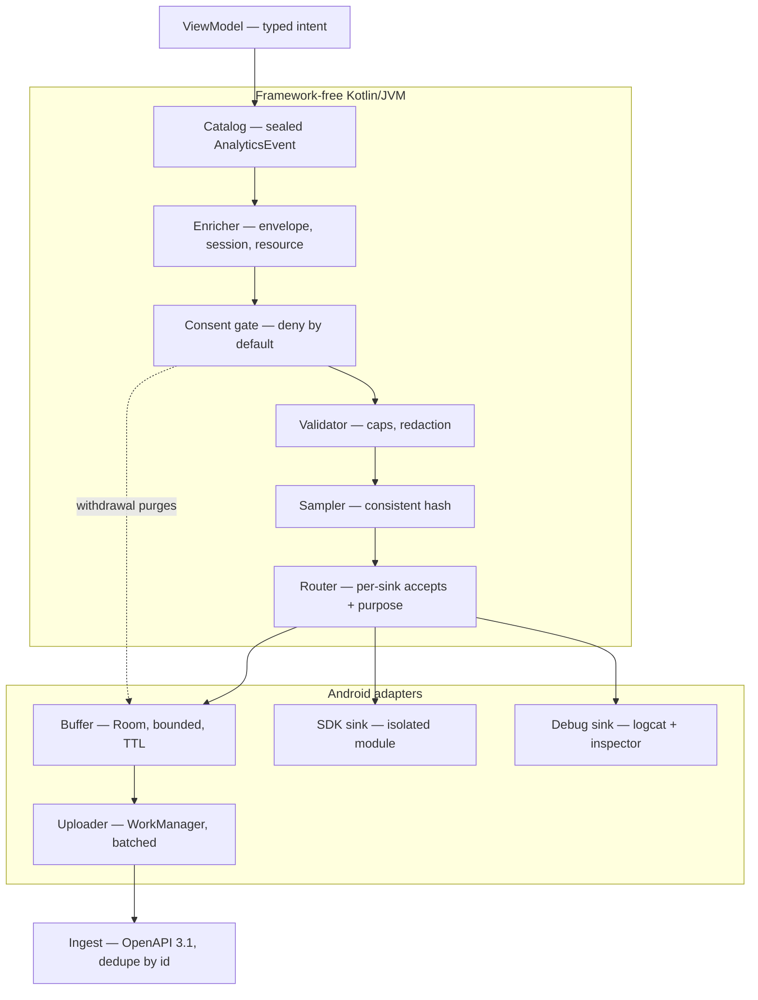
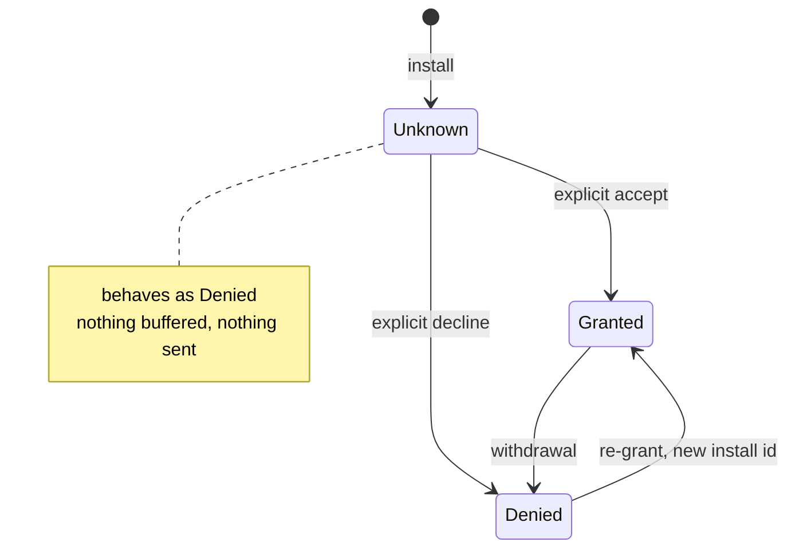

<!--
  GENERATED FILE — do not edit directly. Edit docs/tracking-architecture.html, then run:

      python3 docs/tools/artifact_to_markdown.py \
          docs/tracking-architecture.html docs/tracking-architecture.md

  docs/tracking-architecture.html is the source of truth and is also published as a
  styled page. This Markdown mirror exists so the document is reviewable in
  pull requests and diffable alongside the code it describes.
-->

**Tracking system · Revision 1 · Plan**

# Tracking — system design & architecture

How Sinema will measure itself: a typed event catalog, a consent gate that defaults to no, a durable offline buffer, and one release gate that outranks all of it. Standards are named per concern rather than asserted collectively, so each obligation can be checked against the code that claims to satisfy it.

## §1 Scope, and the constraint that outranks the design

> **Release gate — not a checklist item**
>
> The published privacy policy states that Sinema collects no usage analytics and no device identifiers, and its §9 commits to updating the policy *before* a version that adds analytics is released. That sentence is a promise already made to every current user. So the pipeline is designed and built now, and **nothing leaves the device** until a revised policy and a matching Play Data Safety declaration ship in the same release as the first off-device sink.
>
> The practical consequence runs through the whole design: consent defaults to denied, the consent state is tri-state rather than boolean, and adding an SDK sink must not be a one-line change that quietly starts transmitting. Today it is exactly that (§3).

### In scope

- **Product analytics** — screen views and a small set of deliberate interaction events.
- **Experiment exposure** — which variant a screen actually rendered, paired with the existing `:core:config:api` flag registry.
- **Technical quality** — the pipeline's own loss and latency counters, and cache/refresh outcomes that explain a bad session.
- **Stability** — crash and ANR reporting, treated as a *separate* consent purpose with its own decision (§7).

### Non-goals, written down so they cannot drift

- **No advertising identifier.** The app will not declare `com.google.android.gms.permission.AD_ID`, which since API 33 is what gates access to it. There is no advertising in Sinema and no reason to hold a cross-app identifier.
- **No cross-app, cross-device or cross-install identity.** One pseudonymous id per install, and it does not survive a consent withdrawal.
- **No free-text user content.** Search terms are the tempting exception — they are the single most useful and most identifying field the app could send — and they are excluded. Counts and result-set sizes are not.
- **No third-party attribution or ad SDK**, at any tier.

## §2 Standards baseline

"Industry standard" is not a design decision; a named specification with a stated obligation is. Each row below is a standard this system conforms to, and the obligation it actually imposes on the code — so a reviewer can check the claim rather than accept it.

| Concern | Standard | What it obliges here |
| --- | --- | --- |
| Event envelope | CloudEvents 1.0 | Every event carries `id`, `source`, `type`, `time`, `specversion`, `dataschema` — so ingest routes and validates without a bespoke parser per event. |
| Attribute semantics | OpenTelemetry semantic conventions | Resource and mobile attribute names are adopted, not invented: `service.name`, `service.version`, `os.*`, `device.*`, `session.id`, `app.installation.id`. |
| Correlation | W3C Trace Context | A batch upload sends `traceparent`, so a client-side complaint can be joined to its server-side ingest span. Debug builds only; it is not per-event. |
| Identifiers | RFC 9562 (UUID) | v4 for the install id — unordered on purpose. v7 for event ids: time-ordered, so ingest dedupe and storage stay sequential rather than scattering writes. |
| Timestamps | RFC 3339 / ISO 8601-1:2019 | UTC, millisecond precision, one format everywhere. Device clock skew is carried as a field rather than assumed away (§5). |
| Locale, region, currency | BCP 47 · ISO 3166-1 alpha-2 · ISO 4217 · IANA tzdb | The app already resolves a content region; the event stream uses the same two-letter codes rather than a display name. |
| Schema contract | JSON Schema 2020-12 · SemVer 2.0.0 | One schema file per event type, versioned. Additive changes are minor; a removed or retyped field is a major and needs a new event name. |
| Wire format | RFC 8259 · NDJSON · gzip | One event per line, so a partially corrupt batch loses one line rather than all of it. |
| HTTP semantics | RFC 9110 · RFC 9457 | `Retry-After` is honoured over the local backoff curve; errors come back as Problem Details, not as a bespoke error envelope. |
| Delivery guarantee | At-least-once + idempotency key | Exactly-once is not attainable across a mobile network. Dedupe is the ingest's job, keyed on the event `id`; the client's job is never to lose an event silently. |
| Transport security | RFC 8446 (TLS 1.3) · OWASP MASVS-NETWORK | TLS 1.3, no cleartext, certificate pinning with a backup pin and a documented expiry (§9). |
| Mobile security & privacy | OWASP MASVS v2 · MASTG | MASVS-STORAGE for the on-device buffer, MASVS-NETWORK for transport, MASVS-PRIVACY for identifier handling and the data inventory. |
| Lawful basis | GDPR Art. 5(1)(c), 6, 7, 25, 32 | Data minimisation, consent as the basis, privacy by default, and security of processing. Art. 25 is why the default is denied rather than configurable. |
| Storing an identifier on the device | ePrivacy Directive 2002/58/EC Art. 5(3) | The rule that actually governs analytics identifiers: consent is required before writing or reading one, independently of whether the data is personal. The install id is therefore minted *after* consent, never before. |
| Consent signalling | IAB TCF v2.2 · Google Consent Mode v2 | Purposes 1, 8, 10 and Special Purpose 1 are the only ones in play; the sink receives an `analytics_storage` signal rather than being started or not started. |
| Opt-out | CCPA/CPRA · W3C Global Privacy Control | No sale or sharing occurs, so the obligation is honest disclosure plus a withdrawal that is as easy as the grant (Art. 7(3)). |
| Notice & consent records | ISO/IEC 29184 · ISO/IEC 27701 · ISO/IEC 29100 | A consent record stores *what* was agreed to, *when*, and against *which policy version* — not merely a boolean. |
| Store policy | Play User Data policy · Data Safety | The Data Safety form and the in-app disclosure must agree with the code. This is the gate in §1, and it is enforced by release process, not by a test. |
| Reliability targets | Google SRE — SLI/SLO, error budget | Delivery has an explicit objective and a budget (§8). Spent budget stops new events being added until the pipeline is fixed. |
| Pipeline self-health | OpenTelemetry SDK metric conventions | Queued, dropped and retried counters are exported as events. A pipeline that cannot report its own loss rate cannot be trusted about anything else. |
| Battery & background behaviour | Android vitals thresholds | Uploads run under WorkManager with constraints, never `AlarmManager` and never a wake lock — so the excessive-wakeup and stuck-wake-lock thresholds are structurally out of reach rather than monitored. |

> **What is deliberately not adopted**
>
> Full OTLP and a trace pipeline. Sinema has one client, no services, and no distributed call graph to reconstruct — OTLP's transport and span model would be machinery for a problem the app does not have. The *naming* conventions are worth adopting on their own, because they are the part that makes a field mean the same thing in two systems. Segment's `track`/`identify`/ `screen` call taxonomy is likewise cited as prior art for the catalog shape, not adopted as a vendor contract.

## §3 What exists today, and four ways it fails §2

The ports are already in place and are the right shape: screens depend on `AnalyticsTracker` and a sealed `AnalyticsEvent` catalog, each SDK arrives as an `AnalyticsSink` contributed to a Hilt multibinding, and `CompositeAnalyticsTracker` fans out off the caller's thread. Eight ViewModels already emit events. The existing technical solution rates this **speculative** — full port machinery, one debug sink, no backend — which is accurate but understates it. Read against §2, four of the defects below are live today.

- **Blocking** Consent is hard-coded to granted sinema/di/AppModule.kt:101   `StaticConsentProvider(allowed = true)` is bound in the production graph. It is harmless while the only sink writes to logcat — and it becomes a policy breach the moment a second `@IntoSet` line adds an SDK, which is precisely the one-line extensibility the design advertises. The failure mode is that the cheapest possible change is also the one that starts transmitting without consent, against a published policy that says the app does not.   **Fix:** `ConsentState` becomes an enum — `Unknown`, `Granted`, `Denied` — with no boolean anywhere in the type, defaulting to `Unknown` and treated as denied. `StaticConsentProvider` moves to test fixtures, and a Konsist rule fails the build if it appears in production sources again.
- **Blocking** The gate is evaluated at dispatch, not at enqueue core/tracker/api/…/CompositeAnalyticsTracker.kt   `queue.receiveAsFlow().filter { consent.analyticsAllowed.value }` reads consent when the collector drains an item, while `track()` buffers into a 256-slot channel unconditionally. The decision applied to an event is therefore whatever consent happens to say at an unspecified later moment — so an event recorded while consent was absent can be emitted if the state flips before the queue drains.   The existing test asserts the opposite and passes, because `UnconfinedTestDispatcher` drains eagerly and collapses the window the bug lives in. That makes it a test that certifies the defect. **Fix:** gate at enqueue, so a denied event is never buffered at all, and clear the queue on withdrawal. Re-test on a scheduled dispatcher with an explicit `runCurrent()`.
- **Blocking** Identity bypasses the gate entirely CompositeAnalyticsTracker.setUserId / setUserProperty   Both forward straight to every sink, on the caller's thread, with no consent check — so the one call that *establishes who this is* is the one call the pipeline does not police. Under ePrivacy Art. 5(3) it is also the call most likely to write an identifier. **Fix:** route identity through the same gate and the same queue, and make it ordered with respect to events so a property cannot land after the event that depends on it.
- **Blocking** Backpressure is silent CompositeAnalyticsTracker.track   `queue.trySend(event)` returns a result nobody reads. A full channel discards events with no counter, which means a sampling error, a burst of legitimate traffic and a dropped-event storm are indistinguishable downstream — every one of them just looks like fewer events. **Fix:** count every rejection by reason and export the counters as an event (§8). A pipeline may drop data; it may not drop data quietly.
- **Contract** Events carry no envelope AnalyticsEvent.kt   An event is a name and a `Map<String, Any>`. There is no event id, no timestamp, no session, no schema version and no resource context — so nothing downstream can deduplicate, order or validate anything, and `Any` admits values no sink will accept. §5 replaces this.
- **Contract** Nothing enforces sink limits catalog-wide   A destination SDK imposes hard caps — for Firebase/GA4, 40 characters for an event or parameter name, 100 for a string value, 25 parameters per event, 25 user properties, 500 distinct event names — and events over them are rejected or truncated at the far end, silently, in production only. These belong in a build-time check against the catalog, where they cost nothing.

## §4 Pipeline architecture

Eleven stages, each one a pure step where it can be. The shape follows the project's existing ports-and- adapters rule: the call site names an intent, and every decision about whether, how and where that intent becomes data is made behind the port. A screen must never be able to get this wrong, because a screen is where it would be got wrong.



| Stage | Responsibility | Why it is its own stage |
| --- | --- | --- |
| Catalog | Names and payload of every event that exists. | A sealed hierarchy makes the full event surface reviewable in one file and auditable by the compiler. Already the design in place, and worth keeping. |
| Enricher | Wraps the event in the §5 envelope. | A pure function of (event, clock, session, resource). Golden-file testable, and the only place that knows what an envelope looks like. |
| Gate | Applies consent at enqueue; purges on withdrawal. | One place answers "is this allowed", for events and identity alike. Two places would eventually disagree, and the permissive one wins by default. |
| Validator | Caps, key deny-list, type narrowing. | Turns a production-only silent truncation into a unit-test failure. |
| Sampler | Consistent hash of the install id. | Hashing the id rather than rolling per event keeps a user wholly in or wholly out, so funnels stay comparable instead of leaking at each step. |
| Router | Per-sink filtering and purpose mapping. | Extends the existing `accepts()` hook: a sink that is authorised for one purpose must not receive events collected under another. |
| Buffer | Durable, bounded queue of pending envelopes. | Offline-first is already the app's rule for content; telemetry gets the same treatment — process death must not be a data-loss event. |
| Uploader | Batching, compression, retry, backoff. | Network policy in one adapter, so retry behaviour is tested against MockWebServer rather than reasoned about. |

### Modules

Six new Gradle modules, following the tiering the Konsist suite already enforces — `core/` knows nothing about Sinema or TMDB, and business logic stays framework-free.

| Module | Tier | Contents |
| --- | --- | --- |
| :core:tracker:api | JVM **exists** | Ports and catalog. Keeps its current role; gains the envelope types. |
| :core:tracker:runtime | JVM | Enricher, gate, validator, sampler, router, counters. All of the logic, none of the platform — so all of it runs on the JVM in milliseconds. |
| :core:tracker:consent | Android | Persisted consent state and audit record over DataStore. |
| :core:tracker:store | Android | Room-backed durable buffer, eviction, TTL. |
| :core:tracker:upload | Android | WorkManager worker, batch assembly, transport against the §9 contract. |
| :core:tracker:debug | Android | The existing Timber sink plus an on-device event inspector, so QA can read the stream without a vendor console. Debug variant only. |
| :core:tracker:firebase | Android | The SDK adapter, if step 06 chooses it. Isolated so that no other module can import a vendor type — enforced, not asked for. |

### Rules worth enforcing in Konsist

The project's own position is that rules which are not enforced decay, and the architecture suite already scans the whole tree from disk. Five additions belong in it, each one the mechanical form of a decision made above:

- `StaticConsentProvider` appears in **no production source** — the defect in §3 cannot recur by inattention.
- `com.google.firebase.*` appears only in `com.bigon.core.tracker.firebase`, the same containment already applied to Play's update API.
- `:core:tracker:api` and `:runtime` import no `android.*` or `androidx.*` — add both to the existing JVM prefix list.
- Every `AnalyticsEvent.name` is snake_case, at most 40 characters, and unique across the catalog.
- No `AnalyticsSink` implementation exists outside a tracker module, so a feature cannot hand-roll a second path to a vendor.

> **The call site does not change**
>
> ```kotlin
> // Unchanged from today — which is the point of the port.
> tracker.track(AnalyticsEvent.MovieOpened(movieId, source = "recommendation"))
>
> // Everything below is added behind it: envelope, consent, caps,
> // sampling, routing, durability, upload. None of it is visible here,
> // and none of it can be skipped by a screen that forgets to ask.
> ```

## §5 The event contract

A CloudEvents envelope carrying OpenTelemetry-named context. The envelope is what makes the stream self-describing: ingest can validate, deduplicate and route an event it has never seen before, and a schema change becomes a version bump rather than a coordinated deploy.

| Field | Shape | Source | Note |
| --- | --- | --- | --- |
| specversion | "1.0" | CloudEvents | Envelope version, not schema version. |
| id | UUIDv7 | RFC 9562 | The dedupe key. Time-ordered, so ingest writes stay sequential. |
| type | com.bigon.sinema.movie_opened | CloudEvents | Reverse-DNS prefix + the catalog name, unchanged. |
| source | /sinema/android | CloudEvents | Producer identity, not a user identity. |
| time | 2026-09-03T14:02:11.482Z | RFC 3339 | When the event occurred, by the device clock. |
| dataschema | …/movie_opened/1.0.0.json | JSON Schema | Resolvable URI; the version is SemVer. |
| data | object | — | The event's own parameters, snake_case, validated against the schema. |
| service.name / .version | sinema / 1.4.2 | OTel | Which build produced this. The first question asked of any anomaly. |
| os.name / .version | android / 15 | OTel | API level travels alongside as an integer. |
| device.model.identifier | Pixel 10 Pro Fold | OTel | Model only. No serial, no build fingerprint, nothing device-unique. |
| session.id | UUIDv4 | OTel | Rotates on 30 minutes of inactivity (§6). |
| app.installation.id | UUIDv4 | OTel | The only durable identifier in the system. |
| sent_at | RFC 3339 | — | When the batch left the device, so queue latency is measurable. |
| clock_offset_ms | integer | — | Device clock minus elapsed-realtime drift. Ingest records its own receive time; with all three, skew is recoverable rather than guessed at. |

> **One event on the wire**
>
> ```kotlin
> {
>   "specversion": "1.0",
>   "id": "01922b7e-3f21-7c44-9a10-6f2b3c4d5e6f",
>   "type": "com.bigon.sinema.movie_opened",
>   "source": "/sinema/android",
>   "time": "2026-09-03T14:02:11.482Z",
>   "dataschema": "https://sinema.example/schemas/movie_opened/1.0.0.json",
>   "data": { "movie_id": 27205, "source": "recommendation" },
>   "resource": {
>     "service.name": "sinema", "service.version": "1.4.2",
>     "os.name": "android", "os.version": "15", "os.api_level": 35,
>     "device.manufacturer": "Google", "device.model.identifier": "Pixel 10 Pro Fold",
>     "app.installation.id": "9d1f0e6a-5c8b-4a2e-9f31-0c7a6b5d4e33",
>     "session.id": "5f4e3d2c-1b0a-4998-8877-665544332211",
>     "content.region": "ID", "locale": "en-GB"
>   },
>   "clock_offset_ms": -412
> }
> ```

> ### Naming
>
> - **snake_case**, unique, ≤ 40 characters — enforced by the Konsist rule in §4.
> - **noun then past-tense verb**: `movie_opened`, not `open_movie`. An event records what happened, not what was requested.
> - `screen_view` keeps its name because GA4 reserves it; fighting a reserved name costs the platform's own reporting for nothing.
> - Parameters are snake_case, ≤ 40 characters, string values ≤ 100, at most 25 per event.

> ### Evolution
>
> - **Additive only** within a major: new optional parameter, minor bump.
> - **Removing or retyping** a parameter is a major bump and a new event name — old clients keep sending the old shape for as long as they exist, which on Android is years.
> - **Deprecation** marks the catalog entry and keeps accepting it for two release cycles; ingest never rejects an event it once accepted.

## §6 Identity

Four identifiers could exist here. Three of them will not.

| Identifier | Shape | Lifetime | Reset | Leaves device |
| --- | --- | --- | --- | --- |
| app.installation.id | UUIDv4, DataStore | Minted on consent, not on install | Withdrawal, clear-data, or a button in Settings | **yes — pseudonymous** |
| session.id | UUIDv4, in memory | 30 min inactivity, or process death | Automatic | **yes** |
| user id | none | — | — | **never — no accounts** |
| advertising id | not requested | — | — | **never — no AD_ID permission** |

> **Pseudonymous, not anonymous**
>
> The install id is pseudonymisation in the sense of GDPR Art. 4(5), which means the data remains personal data and retention, deletion and access obligations all still apply. Calling the stream "anonymous" would be the convenient description and the wrong one — the EDPB's bar for anonymisation is irreversibility, and an id that links every event from one device does not clear it. The design consequence is §10: there has to be a real deletion path, not a claim that none is needed.

**The id is minted after consent, and rotated on re-grant.** A pre-consent id would be an identifier written to storage before permission, which is the specific thing ePrivacy Art. 5(3) prohibits. Rotating on re-grant costs the ability to join a returning user's old and new data — which is exactly the join a withdrawal was meant to prevent.

## §7 Consent

Three states, one of which is not a decision. `Unknown` is the state before anyone has been asked, and it behaves exactly as `Denied` — the distinction exists so the app knows whether it still owes the user a question, never so it can treat silence as agreement.



| Purpose | Asked | Standard mapping | Default |
| --- | --- | --- | --- |
| Product analytics | Explicitly, once, in Settings and on first run | TCF P8, P10 · `analytics_storage` | **denied** |
| Storing the install id | Part of the same question | TCF P1 · ePrivacy Art. 5(3) | **denied** |
| Crash & ANR reporting | Separately — see below | TCF SP1 | **denied** |
| Advertising, personalisation | Not asked | TCF P3, P4, P7 · `ad_*` | **not collected** |

> ### On withdrawal, in this order
>
> - Stop the gate — synchronously, before the call returns.
> - Purge the durable buffer and cancel scheduled uploads.
> - Delete the install id.
> - Signal the SDK sink (`analytics_storage: denied`) rather than merely stopping calls to it — a vendor SDK with its own queue will otherwise keep flushing.
> - Write the audit record.

> ### The audit record
>
> ISO/IEC 29184 asks for a record of what was agreed to, not a boolean. Stored: the decision, the timestamp, the privacy-policy version in force, the app version, and which surface asked. Without the policy version, a future change to the notice makes every prior consent unaccountable — nobody can say what the user actually agreed to.

> **Crash reporting is a separate question**
>
> Bundling stability into the analytics consent is the industry default and is wrong for this app, because the two have genuinely different bargains: a crash report is data about a failure the app owes the user, while an analytics event is data about a user the app owes nobody. The published policy currently promises neither, so both need asking — and a user who declines analytics but wants their crashes fixed should be able to say so. Play already reports crashes independently of the app, which the policy discloses; that channel is unaffected either way.

No dark patterns, and this is a design constraint rather than a sentiment: accept and decline get equal visual weight in the same style, declining takes exactly one tap, and withdrawal lives at the same depth in Settings as the grant. Art. 7(3) requires withdrawal to be as easy as consent, and an asymmetric pair of buttons is the most common way that requirement is failed.

## §8 Delivery, reliability and the pipeline's own health

At-least-once delivery with ingest-side deduplication. Exactly-once across a mobile network is not available: a client force-stopped between upload and acknowledgement cannot know which happened, and the only honest choices are to risk a duplicate or risk a loss. This design duplicates and dedupes, because a duplicate is recoverable at ingest and a loss is not recoverable anywhere.

| Parameter | Value | Reasoning |
| --- | --- | --- |
| Flush triggers | app backgrounded · 6-hourly periodic · buffer 80% full | Backgrounding is the moment the user is not waiting; periodic catches the install that is never backgrounded cleanly. |
| Scheduler | WorkManager, NetworkType.CONNECTED | Doze and App Standby are respected by construction. No alarms, no wake locks, so Android vitals' bad-behaviour thresholds are unreachable rather than monitored. |
| Batch cap | 500 events or 1 MiB uncompressed | Whichever comes first; gzip on the wire. A 413 splits the batch rather than dropping it. |
| Retry | exponential, full jitter, 30 s base, 6 h cap, 7 attempts | Full jitter rather than plain doubling: a server that recovers must not be hit by every client in the same second. `Retry-After` overrides the curve. |
| Buffer cap | 10 000 events · 5 MiB · 7-day TTL | Oldest evicted first, and counted. A device offline for a week has more interesting problems than its telemetry. |
| Never retried | 4xx except 408, 429 | A rejected schema will be rejected identically forever; retrying it spends battery to no effect. |

### Counters, and why they are events too

Every drop has a reason and every reason has a counter — `dropped_backpressure`, `dropped_ttl`, `dropped_consent`, `dropped_invalid`, `retries`, `queue_depth`, `upload_latency_ms` — emitted as an event on each flush. This is what OpenTelemetry's SDKs expose for the same reason: without it, the pipeline's loss rate is invisible precisely when it matters, because loss looks identical to low usage. It is also the one piece of instrumentation that pays for itself before a single product question is answered.

> **Objectives — targets, not measurements**
>
> - **≥ 99%** of gated events accepted by ingest within 24 hours of enqueue.
> - **≤ 0.5%** permanent loss, excluding withdrawal purges, measured against the counters above rather than inferred from volume.
> - **p95 < 1 ms** added to the calling frame — telemetry must never be a jank source, and on a foldable at 2076×2152 the frame budget is not generous.
> - **Zero** foreground network requests attributable to tracking.
>
> Error-budget rule: while the loss objective is breached, no new events are added to the catalog. A pipeline that is losing data does not need more data put into it.

## §9 Transport & ingest contract

One endpoint, described by an OpenAPI 3.1 document that is the contract rather than a description of one. The client's OkHttp stack, `ApiCaller` and the `AppResult`/`AppError` vocabulary already exist in `:core:network` and are reused — a failed upload is a value, not an exception crossing a boundary.

> ```kotlin
> POST /v1/events
> Content-Type: application/x-ndjson
> Content-Encoding: gzip
> Idempotency-Key: 01922b7e-3f21-7c44-9a10-6f2b3c4d5e6f   // per batch
> traceparent: 00-4bf92f...-00f067aa0ba902b7-01           // debug builds only
>
> // 202 Accepted  → { "accepted": 500, "rejected": 0 }
> // 400 / 422     → RFC 9457 problem+json, never retried
> // 413           → split the batch, retry the halves
> // 429 / 503     → honour Retry-After, else backoff with jitter
> ```

- **TLS 1.3, no cleartext**, declared in the Network Security Config so a debug proxy cannot silently downgrade a release build.
- **Certificate pinning** with at least one backup pin and a documented expiry date. A pin that outlives its certificate does not degrade — it bricks the endpoint for every installed build, which is unrecallable in the same way a bad forced update is. The pin set is a release-blocking review item, and the failure mode on a pin mismatch is to drop telemetry, never to affect the app.
- **No credential in the client.** The ingest endpoint is unauthenticated-but-attested if abuse becomes real; Play Integrity is the mechanism and it is explicitly deferred, because an anti-abuse control on a pipeline that carries no revenue and no personal profile is cost before benefit.
- **The uploader is not on the app's Retrofit instance.** A separate client keeps telemetry's timeouts, pinning and interceptors from touching the path that serves the user content.

## §10 Governance, retention and rights

> ### The catalog is the registry
>
> Schemas live in the repository at `docs/schemas/<event>/<semver>.json`, generated from the sealed catalog and committed — so a schema change is a reviewable diff and a code change cannot land without one. The generator failing is a build failure. No vendor console is the source of truth for what an event means.

> ### Retention
>
> Event-level rows: **14 months**, then deleted — GA4's own maximum for standard properties, adopted rather than argued about. Derived aggregates carrying no install id: retained indefinitely. Deletion is a scheduled job whose last run is monitored, because an unmonitored retention job is a retention policy that exists only on paper.

> **The access and deletion problem, stated honestly**
>
> Sinema has no accounts, so there is no way for the developer to identify a requester's data. The only mechanism that can satisfy GDPR Art. 15 and Art. 17 for a pseudonymous install id is a client-side one: a button in Settings that sends the install id with an export or erasure request, because the app is the only party that knows it. If the id has already been reset, the link is gone and the request cannot be served — and the policy must say so plainly rather than implying a capability that does not exist.

- **Data inventory** — one table, in the policy and in this document, listing every field that leaves the device. Any field not on it is a defect, and the golden-file envelope test is what makes that checkable.
- **Processor disclosure** — a vendor sink adds a processor and changes the Play Data Safety answers. That is a policy revision, not a dependency bump.
- **Children** — the app is not directed at children; no vendor sink may be configured with an advertising identifier, which Play's Families policy would prohibit in any case.

## §11 Testing & enforcement

The project's existing shape holds: JVM unit tests by default, Robolectric for Compose, Konsist for structure, MockWebServer for transport. Because most of this pipeline is framework-free, most of it is directly testable. The tests below are the ones that correspond to a decision that could silently regress — each one exists because a specific failure would otherwise reach production unnoticed.

| Test | Asserts | Failure it prevents |
| --- | --- | --- |
| Consent at enqueue, on a *scheduled* dispatcher | An event tracked while `Unknown` never reaches a sink, even if consent is granted before the queue drains. | The §3 defect — and the current test, which hides it. |
| Identity is gated | `setUserId` while denied reaches no sink. | Identity established without permission. |
| Withdrawal purges | Buffer empty, work cancelled, id deleted, audit written — in that order. | Data uploaded after a user said stop. |
| Backpressure is counted | 1 000 events into a 256-slot queue drop 744 and report 744. | Silent loss indistinguishable from low usage. |
| Envelope golden file | A fixed event, clock and resource serialise byte-for-byte, and validate against the committed JSON Schema. | A field appearing on the wire that the data inventory does not list. |
| Catalog caps | Every event and parameter is within the strictest destination's limits. | Production-only truncation at the far end. |
| Transport, against MockWebServer | `429` + `Retry-After: 120` schedules at 120 s, not the backoff curve; `422` is never retried; `413` splits. | A retry storm, or a battery drain against a permanent failure. |
| Buffer eviction | TTL and cap evict oldest-first and survive process death. | Unbounded growth on a long-offline device. |
| Konsist — the five rules in §4 | Structure matches the design. | Vendor types leaking; the consent default returning. |
| Macrobenchmark | Tracking adds under 1 ms to the p95 frame; no foreground request. | Jank introduced by measurement. |

> **One thing no unit test can establish**
>
> "No sink was called" and "nothing left the device" look identical in a JVM test and are not the same claim — the same distinction as a screen drawn on top of the app versus a screen that actually blocks it. Before the first release with a sink, the consent-denied state has to be verified on the wire: drive the app through every screen with consent denied and confirm no request to the ingest host appears, in `adb logcat` and at a proxy. That is a scripted rehearsal with an artefact attached to the release, not a test suite entry.

## §12 Delivery sequence

Ordered so that the first four steps ship no data at all, and the step that could is gated behind the one that makes it lawful. This slots into step 05 of the existing delivery plan — production hardening — without reordering anything already committed to there.

1. **Fix the four defects in place**

   No new modules. Consent becomes tri-state and denies by default; the gate moves to enqueue; identity goes through it; drops are counted by reason. Tests first, including the one that replaces the test currently certifying defect 2. Nothing about the app's behaviour changes — which is the point: this is the step that makes every later step safe to take.

2. **Envelope and contract**

   `:core:tracker:runtime` with the enricher, validator and sampler. Schema generation from the catalog, golden files, the Konsist naming and containment rules. The debug sink starts printing full envelopes, so the stream is reviewable on a device before it is transmissible anywhere.

3. **Consent surface and persistence**

   `:core:tracker:consent`, DataStore-backed, with the audit record and the purge path. A Settings entry and a first-run question, both with equal-weight choices. Still no off-device sink: the whole consent mechanism is built and tested while the answer cannot yet matter.

4. **Buffer and uploader, against a mock**

   `:core:tracker:store` and `:core:tracker:upload`. MockWebServer for the transport matrix, WorkManager tests for scheduling and constraints, the counter event wired to the debug inspector. The pipeline is complete and demonstrably end-to-end while pointing at nothing real.

5. **The policy gate**

   Privacy policy revision naming every field in the data inventory, the processor if there is one, the retention period and the deletion path. Play Data Safety declaration updated to match. In-app notice. The consent-denied wire rehearsal from §11, with its artefact. Nothing in step 06 ships before all of this has landed.

6. **First real sink, behind a kill switch**

   Either the first-party ingest or `:core:tracker:firebase`. Gated by a flag in the existing `Flags` registry so it can be switched off without a release, and rolled at 1% → 10% → 100% with the counter event watched at each step. The kill switch is checked before the rollout begins, not assumed.

> **Decisions this plan does not make**
>
> - **First-party ingest or Firebase.** Not a preference — they have different policy consequences. A Firebase sink adds Google as a processor, changes the Data Safety answers and brings an SDK with its own queue and its own consent surface. First-party means owning an endpoint, retention and a deletion job. The architecture is indifferent; the disclosure is not.
> - **Whether crash reporting is asked separately.** Recommended above; it costs a second question on first run, which is a real product cost.
> - **Sampling rate at launch.** §13 explains why 100% is the likely right answer for a first release, and it is still a decision.

## §13 Known limits

- **Consent denied is not zero telemetry.** Play reports installs, crashes and vitals independently of the app, which the current policy already discloses. "No analytics" never means "no data about you exists", and the notice should not imply otherwise.
- **No exactly-once.** A device force-stopped between upload and acknowledgement resends. Duplicates are the ingest's problem by design, and an ingest that stops deduplicating produces inflated counts that look like growth.
- **Sampling makes small cohorts unmeasurable.** At 1%, a 200-install cohort yields two users and no usable funnel. For a first release the honest options are 100% or accepting that the release measures nothing — a rate chosen for a scale the app does not have is the worst of both.
- **Clock skew is recoverable, not solved.** A device with a wrong clock that never successfully uploads has no reference point at all, and its events carry a plausible-looking timestamp that is simply wrong.
- **The remote kill switch needs a network.** A device that never fetches config cannot be stopped remotely, so the local caps in §8 are the real backstop. A kill switch is a convenience; the bounds are the control.
- **The buffer is readable on a rooted device.** Bounded, short-lived and free of content is the mitigation; encrypting it would protect pseudonymous event names from someone who already has the device, which is not the threat worth paying for.
- **Every number in §8 is a target.** Nothing in this document has been measured on a device, because none of it is built yet. The §11 suite is what turns the targets into claims, and until it runs they should be read as intent.

---

Sinema · tracking system · Revision 1 — design, unverified · Companion to the technical solution (§4 cross-cutting contracts)
